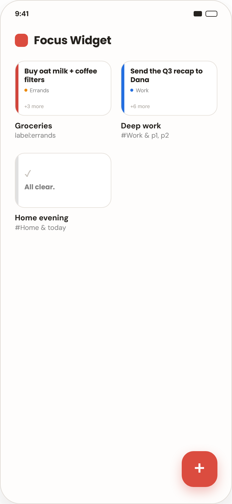

# Focus Widgets

[](LICENSE) [](https://expo.dev/) [](https://reactnative.dev/) [](https://www.typescriptlang.org/) [](https://biomejs.dev/) [](#getting-started) [](#roadmap)

An Android app that turns your Todoist tasks into big, bright home-screen widgets — one filter, one widget, one task you can't ignore.



> This application is not created by, affiliated with, or supported by Doist. "Todoist" is a trademark of Doist Inc.


## Motivation

A task list is easy to stop seeing. The official Todoist widgets show a dense list of small rows, and after a week the eye slides past them like past any other icon on the home screen.

Focus Widgets takes the opposite approach, inspired by [Duro: Habit Tracker for Elites](https://play.google.com/store/apps/details?id=com.duro.habits): a widget shows **the first task** matching a filter in large type, with a colored priority stripe and a `+N more` counter. You build the filter once — by project, priority, due date or label — and the widget keeps pointing at whatever matters right now.

Two things worth knowing:

- Filters are evaluated **locally**. The app pulls tasks, projects and labels through the Todoist Sync API into a SQLite cache and matches them on the device, so widgets render without a network round-trip and only deltas are downloaded on refresh.
- Only fields available on the **free** Todoist plan are used: project, priority, due date and labels, combined with AND or OR.


## Features

Implemented so far:

- **Authorization** by personal Todoist Access Token — no OAuth. The token is validated against the Todoist API and stored in `expo-secure-store`.
- **Widget list screen** — a grid of widget previews with their names and filter queries, a reload button for a full Todoist resync, logout with confirmation.
- **Filter form** — a two-step form: build the query (projects, priorities, due date, labels, AND/OR), then name the widget with a live preview. Create, edit and delete.
- **Pin widget** — the first matching task, its project and the `+N more` counter; an "All clear." placeholder when nothing matches. Tapping the task opens it in Todoist.
- **Pinning flow** — long press on a widget card (or on the form's submit button) places the widget on the Android home screen via the system pinning dialog.
- **Widget updates** — after every Todoist sync, when the app returns to the foreground, by the reload button on the widget itself, and every 30 minutes through `updatePeriodMillis`. Network and auth errors are shown right in the widget.


## Tech stack

| Layer | Choice |
|---|---|
| Platform | Expo SDK 57 (Continuous Native Generation), React Native 0.86, TypeScript |
| Routing | Expo Router, file-based routes in `src/app/` |
| Widgets | `react-native-android-widget` — widgets are rendered by React components in a headless JS task |
| Data | `@doist/todoist-sdk` (Sync API), TanStack Query, `expo-sqlite`, `expo-secure-store` |
| UI | React Compiler, React Hook Form + Zod, Day.js |
| Architecture | Feature-Sliced Design |
| Tooling | Jest (`jest-expo`) + Testing Library, Biome, Bun |

The app UI and the headless widget handler share one JS runtime and one SQLite connection — see [ADR 01](docs/decisions/01-single-sqlite-connection.md) for why this invariant matters. Other decisions are recorded as ADRs in [`docs/decisions/`](docs/decisions/).


## Getting started

Requires [Bun](https://bun.sh/) and an Android device or emulator. Widgets use native code, so the app does **not** run in Expo Go — it needs a development build.

```bash
bun install
bun run android
```

On first launch the app asks for a Todoist API token: *Todoist → avatar → Settings → Integrations → Developer → Copy API token*.

| Command | Action |
|---|---|
| `bun run android` | build and run a development build on Android |
| `bun run start` | start the dev server for an installed development build |
| `bunx tsc --noEmit` | type-check |
| `bun run test` | run Jest |
| `bun run lint` / `bun run format` | Biome lint / format |
| `bunx expo-doctor` | check dependency compatibility |


## Roadmap

Described in the specification but not implemented yet:

- **List widget** — the full list of matching tasks on top of `ListWidget`
- **Completing a task** straight from the widget, without opening Todoist
- **Deleting a widget** from the home screen together with its filter — for now deleting a filter in the app only unbinds its widgets

The app is Android-only by design; iOS is not planned.


## Documentation

The documentation hub is [`docs/README.md`](docs/README.md) — start there. The full specification is [`docs/SPECIFICATION.md`](docs/SPECIFICATION.md), instructions for Claude Code live in [`CLAUDE.md`](CLAUDE.md). Documentation is written in Russian.


## License

[MIT](LICENSE)
